# 1. Introduction:
### Project Milestone 1 for Code Institute Full-Stack Development Program: HTML/CSS Essentials
This project is a Front-End website for RIBL Capital, an autonomous trading company that leverages cutting-edge AI technology, including its flagship bot, Solomon. The platform is designed to strategically execute buy and sell decisions in the financial markets with precision and efficiency. The website will introduce RIBL to potential clients, showcase its innovative vision, and highlight the advanced capabilities of its AI-driven services.

Solomon, RIBL Capital's leading AI bot, autonomously analyses market trends and real-time data, executing trades based on sophisticated algorithms designed to optimise market opportunities. The technology also has the potential to integrate machine learning for enhanced decision-making, allowing the bot to adapt and evolve over time as market conditions shift. This approach positions RIBL Capital as a forward-thinking leader in the trading industry, offering a highly efficient and independent trading system with minimal human intervention.

The website will be user-friendly, with a clean, professional design that allows visitors to easily navigate and engage with RIBL's brand. It will feature interactive elements, including a contact form for enquiries and direct links to RIBL's social media channels, ensuring clients can connect seamlessly. The site will also provide detailed insights into RIBL’s services, the AI technology of Solomon, and the key investment sectors it targets.

Fully responsive, the website will deliver an optimal experience across all devices, from desktops to smartphones, ensuring accessibility for users on any platform. With its launch scheduled for 2025, this project will establish RIBL Capital’s online presence, paving the way for future growth and expansion as the company continues to innovate in autonomous trading and explore new opportunities in cloud-based solutions.

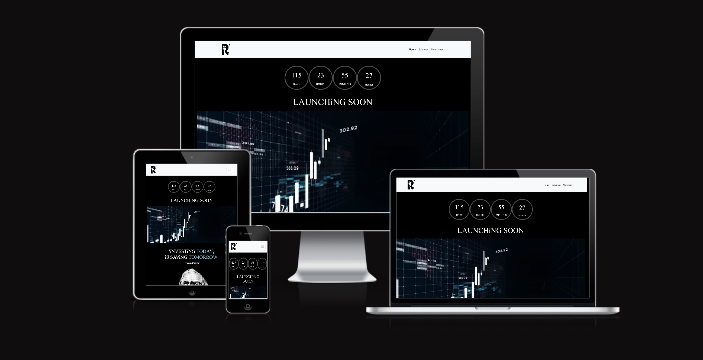

## Table of Contents
1. [Introduction](#Introduction)
2. [Wireframes & Designs](#Initial wireframes)
   - [Home Page](#home-page)
   - [Solomon Page](#solomon-page)
   - [Newsletter Page](#newsletter-page)
3. [Website Features](#website-features)
   - [Navbar](#navbar)
   - [Header](#header)
   - [Theme & Color](#theme--color)
   - [Typography](#typography)
   - [Small i](#small-i)
   - [Footer](#footer)
4. [Website Pages](#website-pages)
   - [Index.html](#indexhtml)
     - [Count-down timer](#count-down-timer)
     - [Warren Buffet](#warren-buffet)
     - [Investment Sector Cards Explained](#investment-sector-cards-explained)
   - [Solomon Page](#solomon-page)
   - [Newsletter Page](#newsletter-page)
5. [Testing](#testing)
   - [SEO: Lighthouse Results](#seo-lighthouse-results)
   - [HTML Testing](#html-testing)
   - [CSS Testing](#css-testing)
   - [Bugs](#bugs)
6. [Future Improvements](#future-improvements)
7. [Deployment](#deployment)
8. [Credits](#credits)

# 2. Initial wireframes:    
The site was designed using a Mobile-first approach, meaning it was created with mobile devices in mind before adapting for larger screens. The wireframes were developed with this focus, ensuring a smooth and user-friendly experience on smartphones and tablets. These wireframes were created using Adobe Illustrator, which allowed for precise design and flexible layouts that work well on different screen sizes. The aim was to keep the design simple and easy to navigate, making sure that key features are clear and accessible on mobile. This approach also ensures that the site will be fully responsive, providing a consistent and seamless experience on any device.

### Mobile Phone mockup screen shots:  

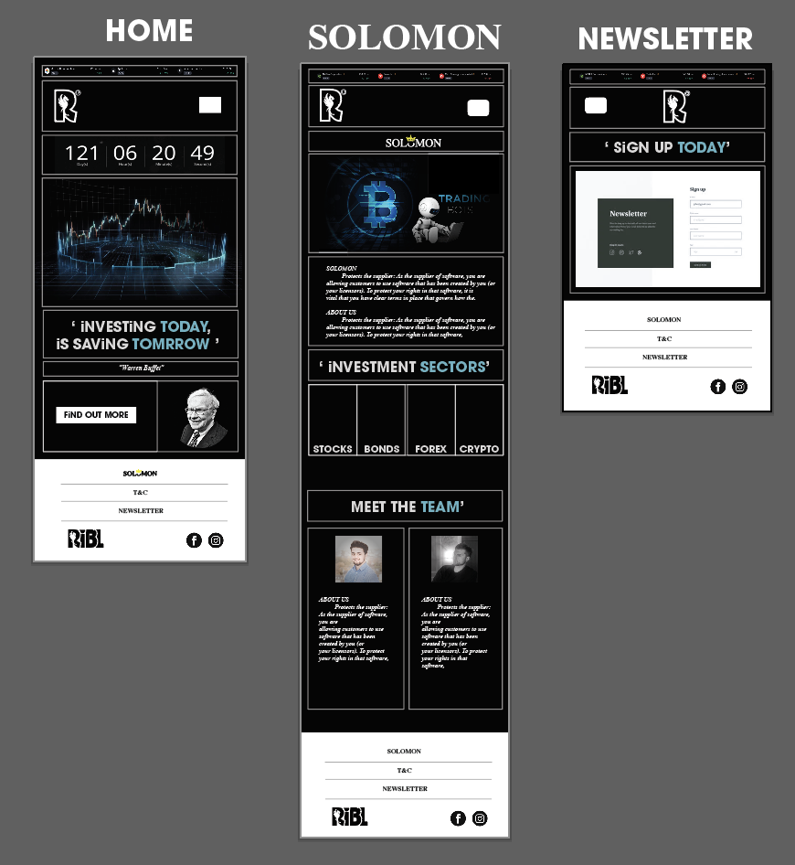
        
### Laptop mockup screen shots: 

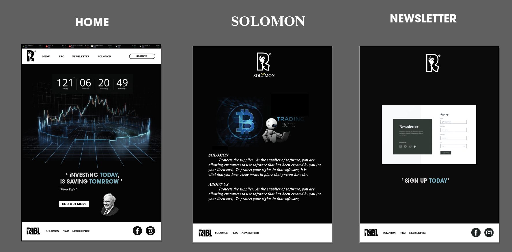

# 3. Website Features: 
## Navbar
The navigation links are located at the top of all three pages, positioned on the right. On larger screens, such as desktops, the links are shown as text: "Home," "Solomon," and "Newsletter." On smaller screens, like mobile devices, the links are hidden behind a burger icon. When you click the icon, a dropdown menu opens with the navigation options. This design makes the site easy to navigate on both large and small screens, ensuring a smooth user experience.
## Header
At the top left of the header section, there is the company logo, which users can click to return to the home page at any time. The logo not only serves as a navigation link but also helps set the tone for the site’s design. It establishes the main colour theme, which includes green, gray, black, and white. These colours are carried throughout the website to create a consistent and professional look, ensuring that the branding is clear and visually appealing.
            
### Screenshot of navigation bar RiBL logo:   

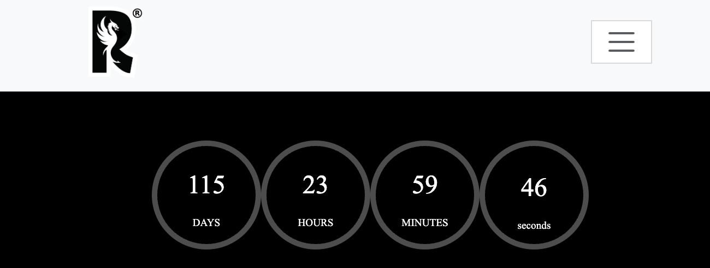
   
    
    
## Theme & color choice
* #ffffff (White)
* #000000 (Black)
* #84c9dd (Teal/ Blue)
* Using black, white, and teal on your RiBL website creates a professional, clean, and modern look. Black and white offer a sleek and readable design, while teal adds a sense of trust, innovation, and calm, ideal for a tech-forward financial service. This color combination balances sophistication and approachability, helping reinforce RiBL's identity as both reliable and cutting-edge.
        
## Typography
* Nunito Sans, sans-serif is used as the main font for the whole website.
* Noto Serif, Times New Roman is Secondary font used through the website.

        
## Small (i)
Gives reference to one of the founders names & highlights the inclusion of internet & Ai driven decition within their trading method.

## Footer
The footer section includes links to the company’s social media profiles on X (formerly Twitter) and Instagram. When clicked, these links open in a new tab, allowing users to browse the company’s social media pages without leaving the site. Adding these links helps build trust and credibility with users, showing that the company is active and engaged with its audience. It also gives users an easy way to stay updated on the latest news and content from the company.

### Screenshot of footer social-links:

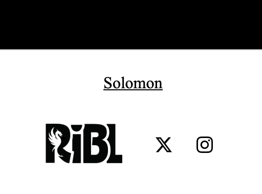

I’ve also included easy-to-navigate links within the footer that lead to other pages of the website. This makes it more convenient for users to move between pages without needing to scroll back up to the top to select a different page. These links are designed to improve the overall user experience by allowing for quicker and smoother navigation, helping users find what they’re looking for with less effort and improving the site's accessibility.

# 4. Website pages:
## Index.html
When you land on the page, you're greeted with a GIF of fluctuating stock prices, instantly giving you a feel for the company's focus and the website's theme. It sets the tone and highlights what the site is all about, giving you a glimpse of what’s coming.

### Count-down timer
A countdown timer will create excitement and anticipation for the official launch of our AI trading bot. It serves as a visual reminder to users, building a sense of urgency and engagement as the launch date approaches. The timer can also help increase user retention, encouraging potential investors and traders to revisit the site regularly, ensuring they don't miss important updates or opportunities to get involved early. Additionally, it can give your website a dynamic, professional feel, signaling that something significant is on the horizon.
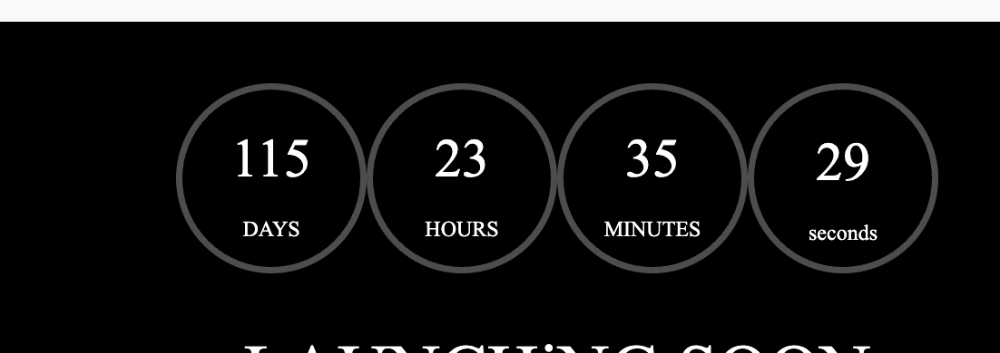

### Warren buffet
"iNVESTiNG TODAY,iS SAViNG TOMORROW"
You’ll see a quote from Warren Buffett alongside his image, giving users a sense of direction and the potential vision for the company’s future. It adds inspiration and reinforces the company’s ambitions, as they aim to achive success similar to Warren Buffett.
            
### Investment sector cards explained 
The interactive investment cards provide users with an engaging overview of the five key economic sectors—stocks, forex, currency, crypto, and futures—that the company plans to target. Each card gives users a glimpse into the diverse investment opportunities RiBL focuses on, highlighting the variety and potential of each sector. This feature not only makes the site more interactive but also helps users understand the broader investment strategy and areas where they can expect growth and innovation.
            

Screenshot of interaction:   

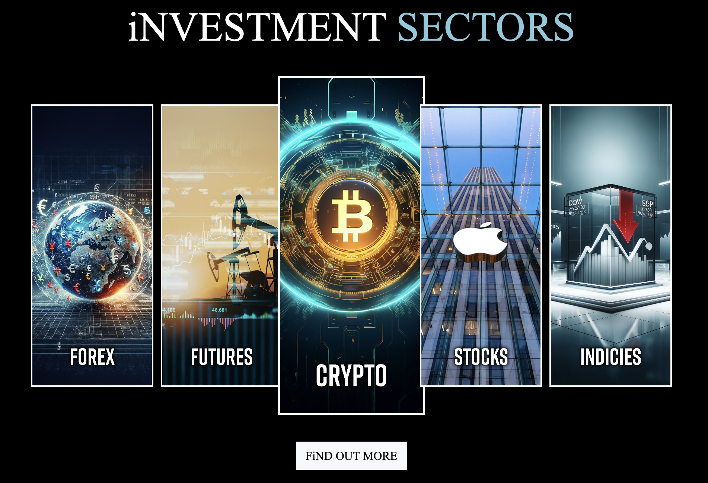
            

## Solomon Page
The design is user-friendly, with text broken up by several hero images that span the full width of the page. This layout makes the content more engaging and easy to navigate. The page also provides users with detailed information about the company, its mission, and the roadmap ahead, offering a clear understanding of what to expect. Instead of including a "Meet the Team" section as in the initial wireframes, the company decided to add a roadmap. They believe that focusing on the company's future plans and vision will be more beneficial for users, helping them understand the direction the company is heading and the milestones to look forward to.

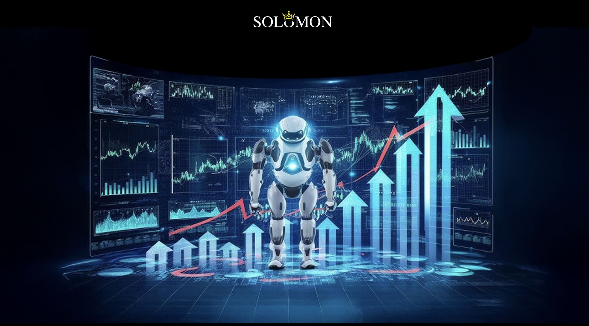
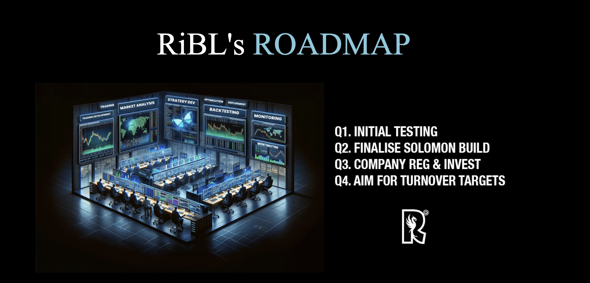
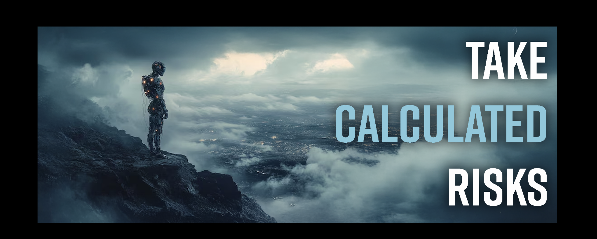

## Newsletter page
The sign-up form allows RiBL to gather user information and send personalised emails based on the investment sector the user selects. These emails will include updates about upcoming events, news, market trends, and important milestones. After submitting the form, users are instantly redirected to a success page. This page lets them know that their submission was successful, giving clear confirmation that their information has been received.

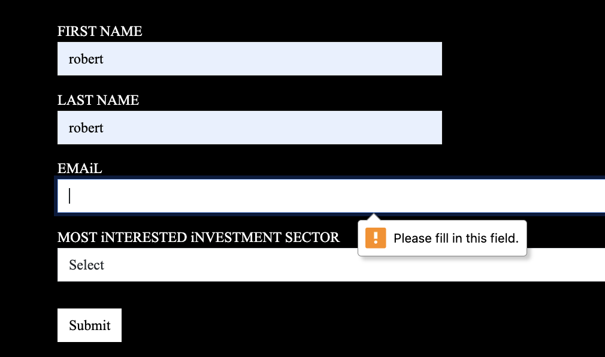
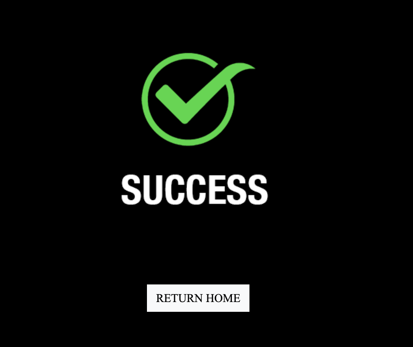

# 5. Testing
SEO: Lighthouse results 

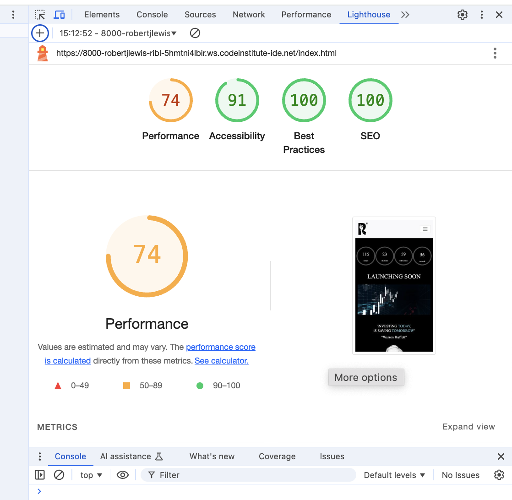

I used Lighthouse to check the pages and made sure the colors and fonts are clear and the site is accessible. I also tested the page in different browsers—Chrome, Safari, and Firefox—and confirmed it works properly in all of them. I checked that all internal links are working and properly redirecting between pages. I also tested that external links to social media sites open in a new tab. Lastly, I made sure the contact form works, with all fields required, the email field accepting only valid emails, and the submit button working as expected.

## HTML testing
### Results: 

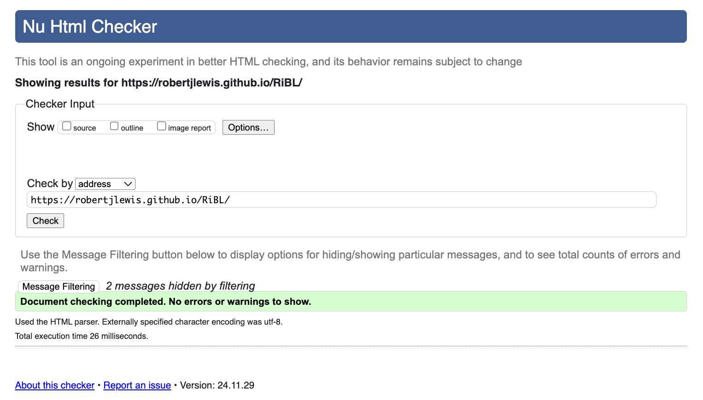

No issues found when running the code through the W3C HTML Validator

## CSS testing 
### Results:
    
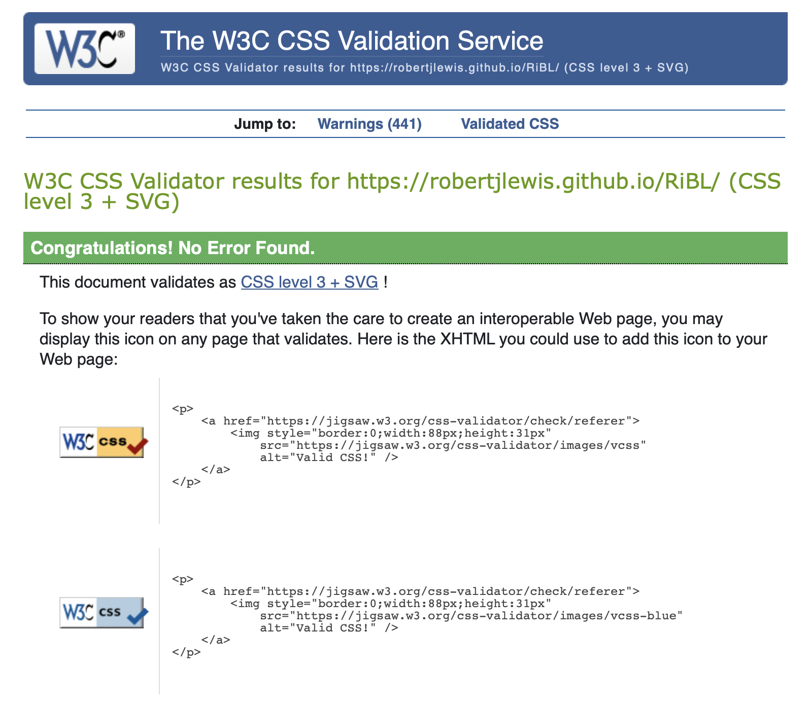

No errors found when running the code through the W3C CSS Validator

## Bugs
No Bugs

# 6. Future Improvements 
If I were to redo this project, I would use web-optimised images instead of PNG files to improve the overall performance and achieve a better score in Google Lighthouse. Web-optimised image formats, such as WebP or JPEG 2000, provide smaller file sizes without compromising image quality, which can significantly reduce page load times. By switching to these formats, the website would load faster, leading to improved performance metrics, including faster visual rendering and better user experience. This change would also help the site rank higher in search engines, as Google rewards fast-loading websites with better visibility.

# 7. Deployment 
### Version Control
The site was developed using the Gitpod editor and pushed to GitHub, where the remote repository is named 'optimal_health'. Throughout the development process, Git commands were used to manage and track changes to the code. These commands allowed for efficient collaboration and version control. The following Git commands were used:

### Git add . 
* This command was used to add all files to the staging area, preparing them for commit.
### Git commit -m "commit message" 
* Once changes were made, this command was used to commit those changes to the local repository, with a relevant commit message describing the updates.
### Git push – 
* This command was then used to push all committed changes to the remote repository on GitHub, ensuring that the latest version of the code was stored online and accessible to other collaborators.
This version control process ensured that the development of the site was well-managed and allowed for easy tracking of changes over time.

## Deployment to Github pages
The site was deployed to Github pages as follows:
In the Github repository, I navigated to Settings tab From the source section drop-down menu, I selected the Master branch and Save Once the Master branch was selected, the page provided the link to the website The live link: Optimal Health.

## Cloning of the Repository Code locally
* Go to the Github repository that you want to clone
* Click on the Code button located above all the project files
* Click on HTTPS and copy the repository link
* Open the IDE of your choice and and paste the copied git url into the IDE terminal
* The project is now created as a local clone

## Technologies Used
* Languages Used
* HTML5
* CSS
* Java
* Bootstrap

## Frameworks - Libraries - Programs Used
* Google Fonts:
* Google fonts were used to import the primary and secondaary fonts throughout the style.css.

## Font Awesome:
* Font Awesome are used as an icons for user UX purposes.

## Adobe
Illistrator and Photosho where used on images through my project for resizing and utalising their Ai generative fill feature

# 8. Credits
I want to give a special thanks to my mentor for all the support and for patiently answering my questions. I’d also like to thank Ieuan and Jyotsna for providing valuable, unbiased, non-tech perspectives, and Lewis for pointing out some great suggestions. Additional id like to thank Steve Powell, Ax de klerk and Jordan Comp for the weekly group chats we have where we discuss learning objectives of modules and projects. 

The icons in the footer and in the headings were taken from Font Awesome.
The social media links to X (Twitter) and Instagram are the real ones this company is using.
The Favicon in the Title of the page was taken from Favicon
I took inspiration from the Board Walk project for the header, footer and sign-up page.

# Pictures & Vidoes 
### Logos: Where created by myself

### Images & Video Links:
* Home Page hero GIF: https://www.vecteezy.com/video/2273297-digital-animation-of-business-stock-market-price-chart 
* Warren buffets face: https://thestrive.co/warren-buffett-advice-on-success/
* Solomon Hero image: https://www.youtube.com/watch?v=TajnkMey-oM (thumbnail)
* Calculated Risk Picture: https://www.freepik.com/premium-ai-image/person-standing-cliff-with-sign-that-says-no-one-wants-be-robot_330743735.htm
* Road-map left image: https://precisionpulsecapital.com/about/
* Forex Graphic: https://www.forexlive.com/Education/how-cpi-data-impacts-currency-pairs-exchange-rates-20241009/
* Futures Graphic: https://www.camecon.com/blog/russian-isolationism-high-oil-and-gas-prices-are-bad-news-for-the-global-economy/
* Crypto Graphic: https://www.2moonsai.com/free-photo-prompt/crypto-logo-shining-bright-world-digital-finance
* Stocks Graphic: https://en.arincen.com/stocks-news/apple-beats-expectations-due-to-strong-iphone-demand-20091
* Indicies Graphic: https://encrypted-tbn1.gstatic.com/images?q=tbn:ANd9GcTsosoY1Ftldh-ZEebeTYMfjEmfguYl33elBrHRCiMfy_4gRYZO

### Please note:
    All images are for my project and are not intended for business or commercial use.