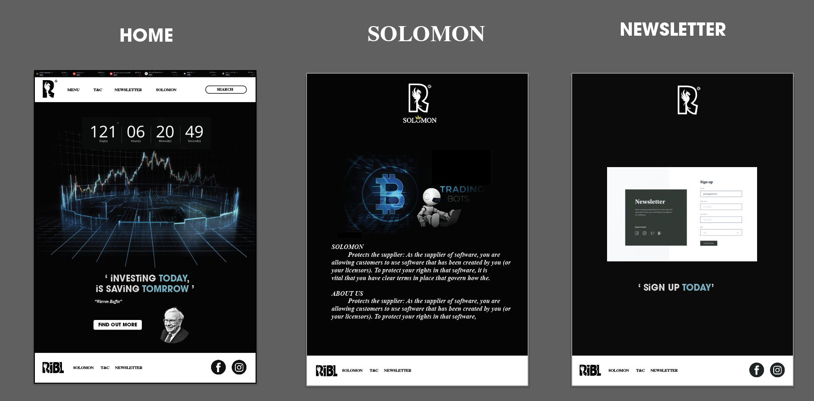
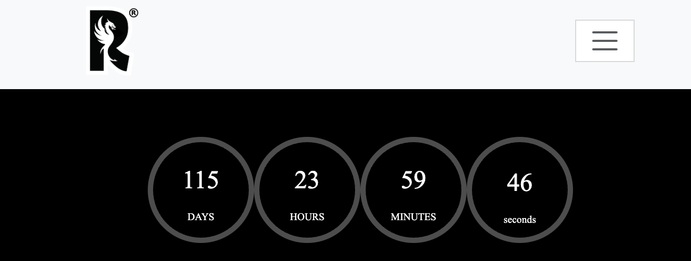
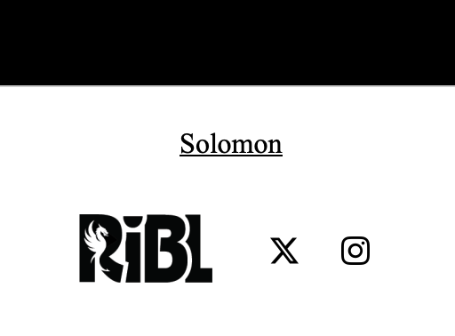
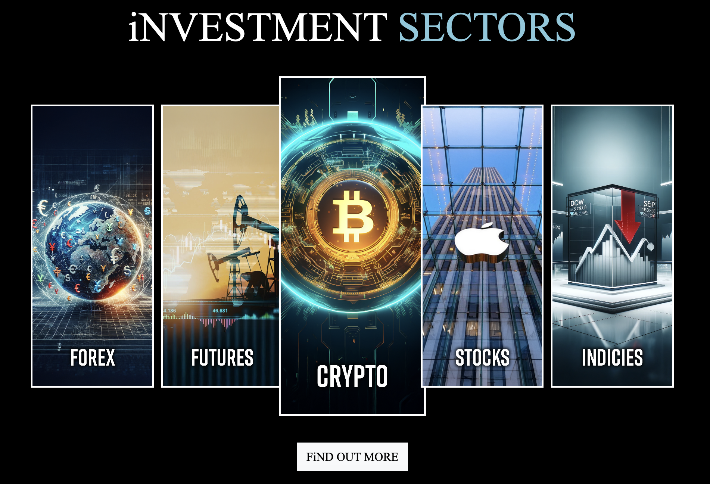
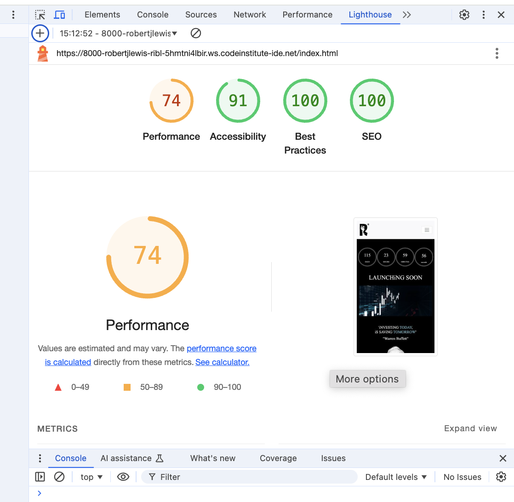
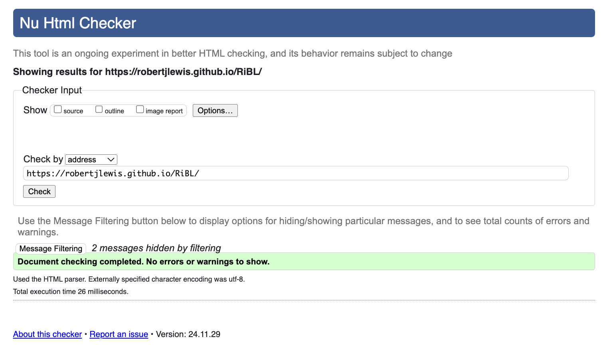

# Introduction:
Project Milestone 1 for Code Institute Full-Stack Development Program: HTML/CSS Essentials
This project is a Front End website for RIBL Capital, an autonomous trading company that leverages advanced AI bots, including one named Solomon, to execute strategic buy and sell decisions in the financial markets. The website is designed to introduce RIBL to potential clients, showcase its innovative brand, and highlight its cutting-edge services. Solomon autonomously analyzes market trends, assesses real-time data, and executes trades based on sophisticated algorithms, with the potential to integrate machine learning for enhanced decision-making over time. By utilizing this technology, RIBL Capital aims to create a highly efficient, independent trading system that optimizes market opportunities with minimal human intervention, while also exploring additional cloud platforms for improved functionality. The site is user-friendly and interactive, allowing visitors to connect with RIBL through a contact form and social media channels.
Users of this website will be able to learn more about the company, the AI trading bot, and the investment sectors it targets. The launch is planned for 2025, and the website is fully responsive, ensuring a seamless experience on all screen sizes.

    

# ReadMe Table Content:
- Introduction 
- Wireframes & Designs
    - Home Page
    - Solomon Page
    - Newsletter Page
- Website Features 
    - Navbar
    - Header
    - Theme & Color
    - Small i 
    - Footer
- Website pages
    - Index.html
    - Count-down timer
    - Warren buffet
    - Investment sector cards explained
- Solomon Page
- Newsletter Page
- Testing
    - SEO: Lighthouse results 
    - HTML testing
    - CSS testing
    - Bugs
- Deployment
- Credits

# Initial wireframes:    
The site was developed with the Mobile-first method. The wireframes were therefore created with that thought in mind, and created using Adobe Illistrator. 
- First Canvas:  Home page.
- Second Canvas: Solomon Page. 
- Third Canvas: Newsletter sign-up page. 

Mobile Phone mockup screen shots:  

        
Laptop mockup screen shots: 

# Website Features: 
- Navbar
Featured at the top of all three pages, the navigation links are situated to the right. On larger screens they show the text; Home, Solomon and Newsletter. On smaller screens, such as mobiles, the navigation links are situated in the burger-icon that expands into a dropdown when you click it.
- Header
The Header at the top left in the header section, there is a company logo, that will take the user to the home page when clicked. The Company logo and sets the main color theme; green, gray, black and white.
            

Screenshot of navigation bar RiBL logo:   

   
    
    
## Theme & color choice
#ffffff (White)
#000000 (Black)
#84c9dd (Teal/ Blue)

Using black, white, and teal on your RiBL website creates a professional, clean, and modern look. Black and white offer a sleek and readable design, while teal adds a sense of trust, innovation, and calm, ideal for a tech-forward financial service. This color combination balances sophistication and approachability, helping reinforce RiBL's identity as both reliable and cutting-edge.
        
### Typography
Nunito Sans, sans-serif is used as the main font for the whole website.
Noto Serif, Times New Roman is Secondary font used through the website.

        
- Small (i)
Gives reference to one of the founders names & highlights the inclusion of internet & Ai driven decition within their trading method.

- Footer
The footer section includes relevant links to X and Instgram. The links will open in a new tab and that give the company more credibility amoungs users.

Screenshot of footer social-links:

Ive also included easy to navigate links to other pages of the website that allow for users to navigate better between pages, instead of going back up to the top of the page to select another page. 

# Website pages:
- Index.html
When you land on the page, you're greeted with a GIF of fluctuating stock prices, instantly giving you a feel for the company's focus and the website's theme. It sets the tone and highlights what the site is all about, giving you a glimpse of what’s coming.

- Count-down timer 
A countdown timer will create excitement and anticipation for the official launch of our AI trading bot. It serves as a visual reminder to users, building a sense of urgency and engagement as the launch date approaches. The timer can also help increase user retention, encouraging potential investors and traders to revisit the site regularly, ensuring they don't miss important updates or opportunities to get involved early. Additionally, it can give your website a dynamic, professional feel, signaling that something significant is on the horizon.

- Warren buffet 
"iNVESTiNG TODAY,iS SAViNG TOMORROW"
You’ll see a quote from Warren Buffett alongside his image, giving users a sense of direction and the potential vision for the company’s future. It adds inspiration and reinforces the company’s ambitions, as they aim to achive success similar to Warren Buffett.
            
- Investment sector cards explained 
The interactive investment cards provide users with an engaging overview of the five key economic sectors—stocks, forex, currency, crypto, and futures—that the company plans to target. Each card gives users a glimpse into the diverse investment opportunities RiBL focuses on, highlighting the variety and potential of each sector. This feature not only makes the site more interactive but also helps users understand the broader investment strategy and areas where they can expect growth and innovation.
            

Screenshot of interaction:   

            

- Solomon Page
The design is user-friendly, with text broken up by several hero images that span the full width of the page. This layout makes the content more engaging and easy to navigate. The page also provides users with detailed information about the company, its mission, and the roadmap ahead, offering a clear understanding of what to expect.

- Newsletter page
The sign-up form enables RiBL to collect user data and send them tailor made emails, depending on preference of choosen investment secotr, about upcoming events, news, market trends or any milestones. after completing the newsletter form you instantly get redirected to a success page, which allows for the user to know they submittion was success. 

- Testing
SEO: Lighthouse results 

I used Lighthouse to check the pages and made sure the colors and fonts are clear and the site is accessible. I also tested the page in different browsers—Chrome, Safari, and Firefox—and confirmed it works properly in all of them. I checked that all internal links are working and properly redirecting between pages. I also tested that external links to social media sites open in a new tab. Lastly, I made sure the contact form works, with all fields required, the email field accepting only valid emails, and the submit button working as expected.

- HTML testing

Results: 

No issues found when running the code through the W3C HTML Validator

- CSS testing 
Results:
    

No errors found when running the code through the W3C CSS Validator

- Bugs
No Bugs

- Deployment 
Version Control
The site was created using Gitpod editor and pushed to Github to the remote repository 'optimal_health'.
    
- Git commands were used throughout the development to push the code to the remote repository. The following git commands were used:
    - Git add . - to add the files to the staging area before being committed.
    - Git commit -m "commit message" - to commit changes to the local repository queue that are ready for the final step.
    - Git push - to push all committed code to the remote repository on Github.

- Deployment to Github pages
The site was deployed to Github pages as follows:
In the Github repository, I navigated to Settings tab From the source section drop-down menu, I selected the Master branch and Save Once the Master branch was selected, the page provided the link to the website The live link: Optimal Health.

- Cloning of the Repository Code locally
    - Go to the Github repository that you want to clone
    - Click on the Code button located above all the project files
    - Click on HTTPS and copy the repository link
    - Open the IDE of your choice and and paste the copied git url into the IDE terminal
    - The project is now created as a local clone

- Technologies Used
    - Languages Used
    - HTML5
    - CSS
    - Java
    - Bootstrap

- Frameworks - Libraries - Programs Used
Google Fonts:
Google fonts were used to import the primary and secondaary fonts throughout the style.css.

- Font Awesome:
Font Awesome are used as an icons for user UX purposes.

- Adobe
Illistrator and Photosho where used on images through my project for resizing and utalising their Ai generative fill feature

- Credits
I want to give a special thanks to my mentor for all the support and for patiently answering my questions. I’d also like to thank Ieuan and Jyotsna for providing valuable, unbiased, non-tech perspectives, and Lewis for pointing out some great suggestions. Additional id like to thank Steve Powell, Ax de klerk and Jordan Comp for the weekly group chats we have where we discuss learning objectives of modules and projects. 

The icons in the footer and in the headings were taken from Font Awesome.
The social media links to X (Twitter) and Instagram are the real ones this company is using.
The Favicon in the Title of the page was taken from Favicon
I took inspiration from the Board Walk project for the header, footer and sign-up page.

- Pictures & Vidoes 
Logos: Where created by myself a

- Images & Video Links:
    Home Page hero GIF: https://www.vecteezy.com/video/2273297-digital-animation-of-business-stock-market-price-chart 
    Warren buffets face: https://thestrive.co/warren-buffett-advice-on-success/
    Solomon Hero image: https://www.youtube.com/watch?v=TajnkMey-oM (thumbnail)
    Calculated Risk Picture: https://www.freepik.com/premium-ai-image/person-standing-cliff-with-sign-that-says-no-one-wants-be-robot_330743735.htm
    Road-map left image: https://precisionpulsecapital.com/about/
    Forex Graphic: https://www.forexlive.com/Education/how-cpi-data-impacts-currency-pairs-exchange-rates-20241009/
    Futures Graphic: https://www.camecon.com/blog/russian-isolationism-high-oil-and-gas-prices-are-bad-news-for-the-global-economy/
    Crypto Graphic: https://www.2moonsai.com/free-photo-prompt/crypto-logo-shining-bright-world-digital-finance
    Stocks Graphic: https://en.arincen.com/stocks-news/apple-beats-expectations-due-to-strong-iphone-demand-20091
    Indicies Graphic: https://encrypted-tbn1.gstatic.com/images?q=tbn:ANd9GcTsosoY1Ftldh-ZEebeTYMfjEmfguYl33elBrHRCiMfy_4gRYZO

* Please note:
    All images are for my project and are not intended for business or commercial use.